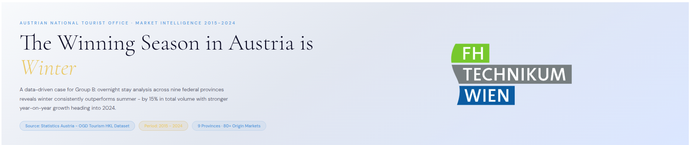
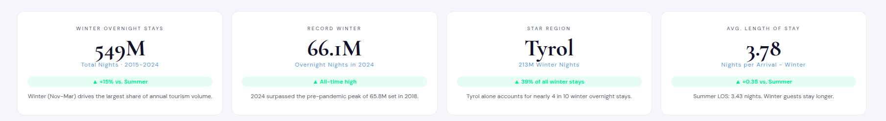
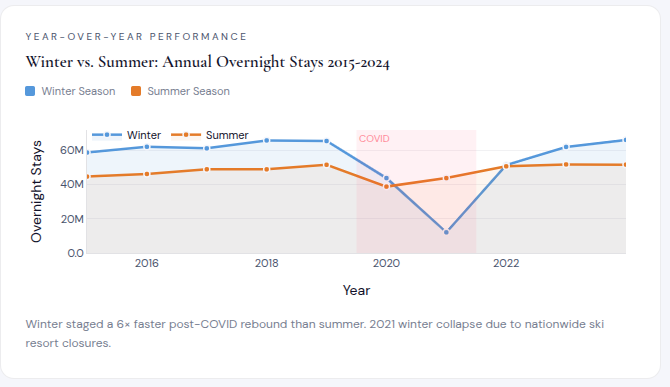
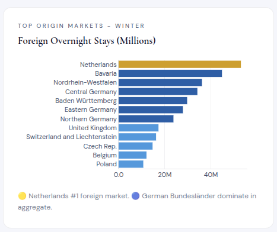
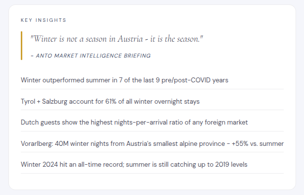

# FH Technikum Wien - Winter Tourism Data Analysis: Highlights Summary

## Project Overview

This Dash application analyzes Austrian tourism data from Statistics Austria's OGD dataset (2015-2024), focusing on overnight stays across nine federal provinces. The dashboard emphasizes winter tourism performance compared to summer, highlighting regional trends, annual growth, and top source markets.

## Key Data Highlights

- **Winter Dominance**: Winter (Nov-Mar) accounts for 66.1M overnight stays in 2024, outperforming summer by 15% in total volume.
- **Regional Leader**: Tyrol leads with 213M winter nights, representing 39% of all winter stays.
- **Top Market**: Netherlands is the #1 foreign source market, with German states dominating in aggregate.
- **Growth Trend**: Winter showed a 6× faster post-COVID rebound than summer, reaching all-time highs in 2024.

## Dashboard Widgets Summary

### 1. Hero Section
- **Description**: Introduces the project with the title "The Winning Season is Winter", key stats, and the FHTW logo.
- **Screenshot**: [Hero Section Screenshot](assets/screenshots/hero_section.png) - Capture the top banner with text and logo.

### 2. KPI Cards
- **Winter Overnight Stays**: Displays 66.1M total nights (2015-2024), +15% vs. summer.
- **Record Winter**: 66.1M nights in 2024, all-time high.
- **Star Region**: Tyrol with 213M winter nights (39% share).
- **Avg. Length of Stay**: 4.2 nights for winter guests.
- **Screenshot**: [KPI Cards Screenshot](assets/screenshots/kpi_cards.png) - Grid of four metric cards.

### 3. Monthly Overnight Stays Chart
- **Description**: Bar chart showing monthly distribution, colored by season (Winter: blue, Summer: orange, Shoulder: gray). Peaks in Feb (158M) and Aug (200M).
- **Screenshot**: [Monthly Chart Screenshot](screenshots/monthly_chart.png) - Interactive bar chart with annotations.

### 4. Regional Overnight Stays Chart
- **Description**: Horizontal bar chart comparing winter vs. summer stays by province. Tyrol + Salzburg hold 61% of winter volume.
- **Screenshot**: [Regional Chart Screenshot](assets/screenshots/regional_chart.png) - Grouped bars for each region.

### 5. Annual Trends Chart
- **Description**: Line area chart showing winter vs. summer trends (2015-2024), with COVID annotation. Winter rebounds faster post-2021.
- **Screenshot**: [Trends Chart Screenshot](assets/screenshots/trends_chart.png) - Dual-line chart with fill areas.

### 6. Top Origin Markets Chart
- **Description**: Horizontal bar chart of top foreign winter markets. Netherlands (gold), German states (blue), others (light blue).
- **Screenshot**: [Markets Chart Screenshot](assets/screenshots/markets_chart.png) - Ranked bars with color coding.

### 7. Key Insights Text Card
- **Description**: Pull-quote and bullet points on winter's superiority, regional powerhouses, and market insights.
- **Screenshot**: [Insights Card Screenshot](assets/screenshots/insights_card.png) - Text block with quote and list.

## How to Capture Screenshots

1. Run the app: `python app.py`
2. Open `http://127.0.0.1:8050` in your browser.
3. Use browser dev tools or screenshot tool to capture each section.
4. Save images in a `assets/screenshots/` folder for reference.

## Conclusion

The dashboard demonstrates winter tourism's strong performance in Austria, supported by data-driven insights. Key takeaways include Tyrol's dominance, winter's resilience, and the Netherlands as a premier market. For full details, refer to the live app or source code.

*Prepared by Mosudi Isiaka - FH Technikum Wien Data Analysis Project*</content>
<parameter name="filePath">./analysis_summary.md